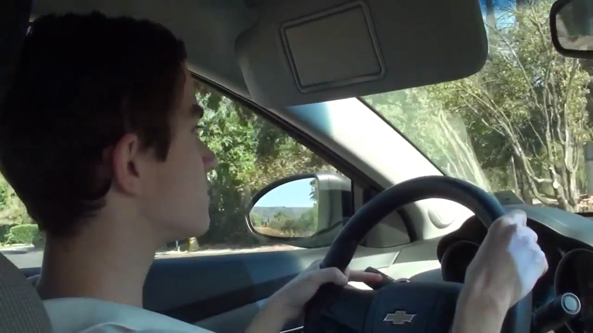
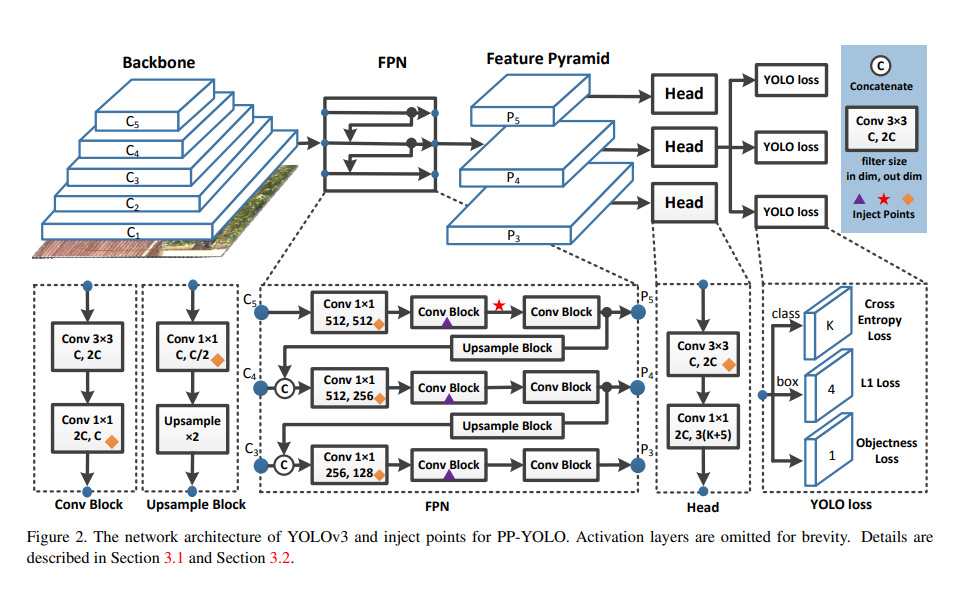
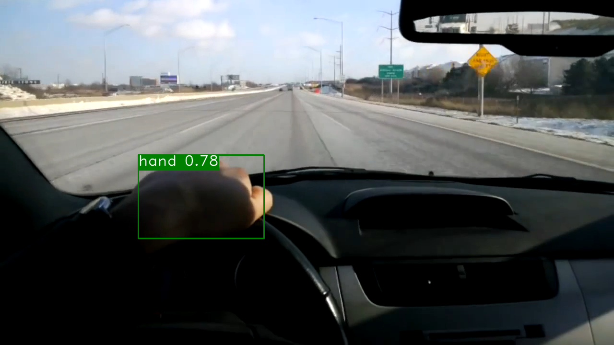
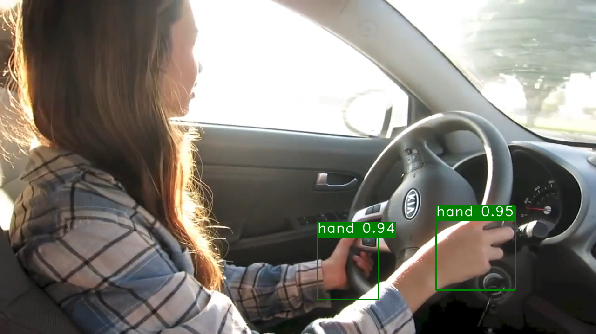
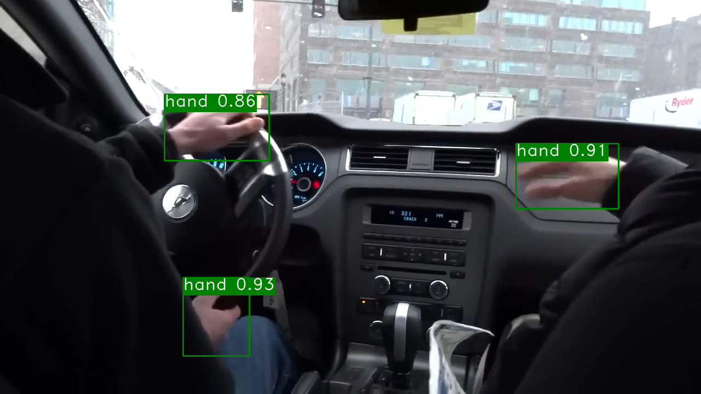
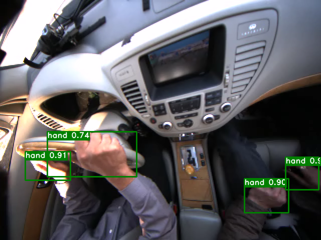
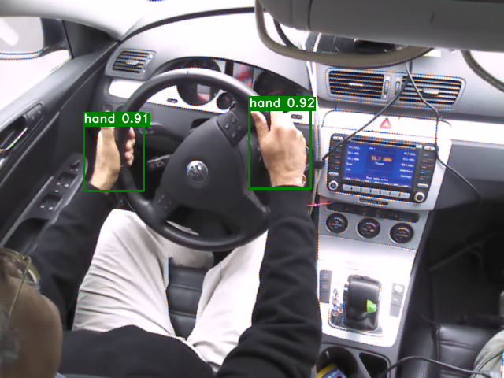

<p align="center">

<p>
  
## Hands On Steering Wheel Detection with PaddlePaddle and AI Studio
### 一、项目背景介绍
目前市面上的自动驾驶，均采用智能辅助+人工监督的方式。如果脱离了人为的监督和干涉就容易导致危险的发生，为了有效提高驾驶安全性，方向盘离手检测被当作是汽车自动驾驶系统的必备选项。通过检测驾驶员的手是否离开方向盘而进行提醒警示，从而保障行车安全。已经实现了的方向盘离手检测的方法有多种，比如电容感应方式、图像识别方式、压力感应方式等。我们基于图像识别的方法设计了一个方向盘离手检测预警系统，具有成本低、易实现，精度高等优点。百度飞桨的AI开发套件简化了项目的开发流程，确保了项目的精度和速度。
  
### 二、数据介绍
HandsOnSteeringWheel  VOC格式的数据集，只标注了手这一个类别 https://aistudio.baidu.com/aistudio/datasetdetail/69849
数据集划分：训练集：验证集：测试集 = 7：1：2
<div>
<ul>
<li></li>
<li></li>
</ul>
</div>  

### 三、模型介绍
目标检测算法的准确性和推理速度不可兼得，为了得到一个兼具性能和速度的检测器，我们选择了比yolo3基础模型训练更快，准确率更高的模型：PP-YOLO 
paper:https://arxiv.org/abs/2007.12099 
Github:https://github.com/PaddlePaddle/PaddleDetection。
<p align="center">

<p>
  
### 四、模型训练
  
### 1.paddlex下载
  ```shell
    pip install "paddlex<=2.0.0" -i https://mirror.baidu.com/pypi/simple
  ```
### 2.模型训练
    
  模型训练使用了Paddlex的API：https://github.com/PaddlePaddle/PaddleX/blob/develop/docs/apis/models/detection.md
 
  模型的轮次、学习率、调整策略等参数的设置如下：
  ```shell
  model.train(
      num_epochs=200,
      train_dataset=train_dataset,
      train_batch_size=30,
      eval_dataset=eval_dataset,
      pretrain_weights='COCO',
      learning_rate=0.005 / 12,
      warmup_steps=500,
      warmup_start_lr=0.0,
      save_interval_epochs=5,
      lr_decay_epochs=[85, 135],
      save_dir='output/ppyolo_r50vd_dcn',
      use_vdl=True)
  ```
 ### 3.训练可视化
<div>
<ul>
<li></li>
<li></li>
<li></li>
</ul>
</div>  
  
### 五、模型评估
### 1.模型测试
模型评估使用了Paddlex的API：https://github.com/PaddlePaddle/PaddleX/blob/develop/docs/apis/models/detection.md
各参数介绍与调整说明：https://github.com/PaddlePaddle/PaddleX/blob/develop/docs/parameters.md
      
```shell
model.evaluate(eval_dataset, 
      batch_size=1, 
      epoch_id=None, 
      metric=None, 
      return_details=False)
```
|Model |AP(VOC) |mAP<sup>val<br>0.5:0.95 | mAP<sup>val<br>0.5 |mAP<sup>val<br>0.75)|
| ------        |:---:  |  :---:       |:---:     |:---:  |
|PPYOLO |0.909  |0.739 | 0.990 |0.929 | 
      
### 2.测试用例可视化
<div>
<ul>
<li></li>
<li></li> 
<li></li> 
<li></li>
<li></li> 
</ul>
</div>    

  
### 1.Installation paddlex
pip install "paddlex<=2.0.0" -i https://mirror.baidu.com/pypi/simple


### 3.models
 
 
